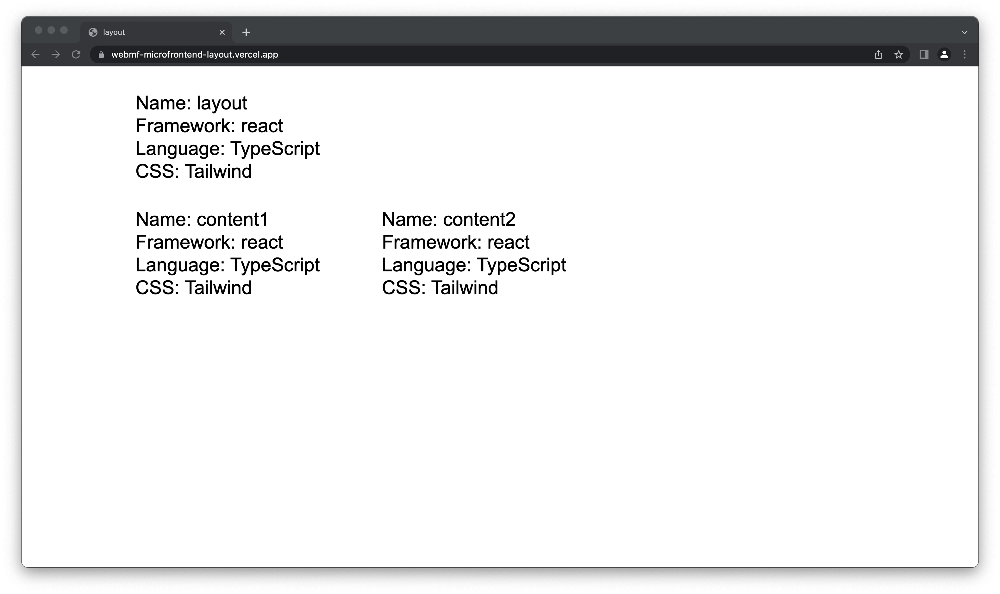

# **Web Micro-Frontend Layout**

Build micro-frontend to serve main layout by using module federation (webpack5) style.

## **Requirements**

- Content area #1 : https://github.com/patharanordev/webmf-microfrontend-content1
- Content area #2 : https://github.com/patharanordev/webmf-microfrontend-content2

## **Example**

### **Firebase Cloud Messaging (FCM)**

More detail, [here](./docs/FCM.md).
