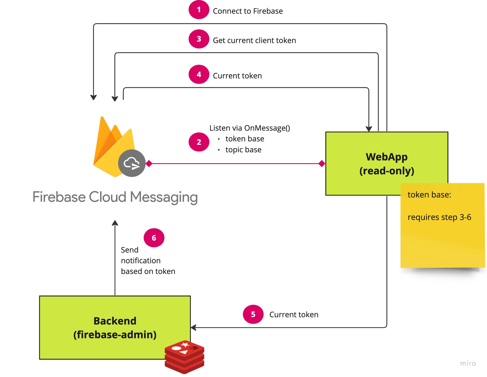
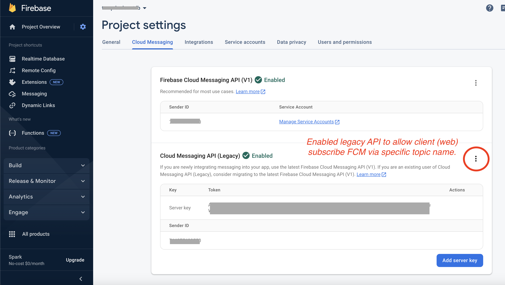
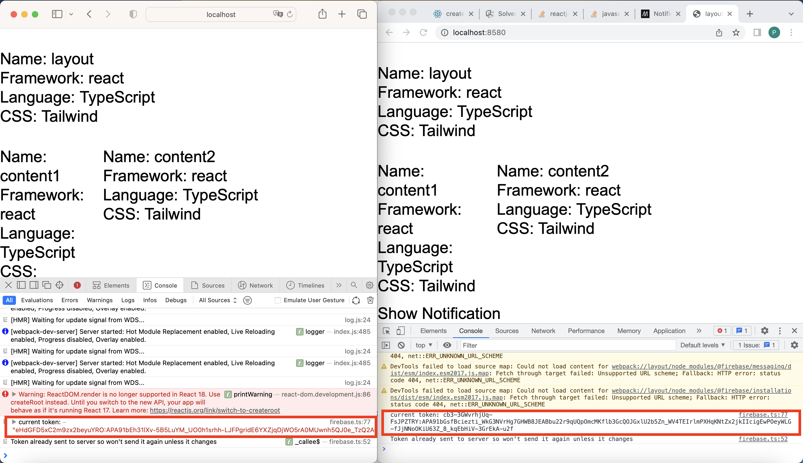
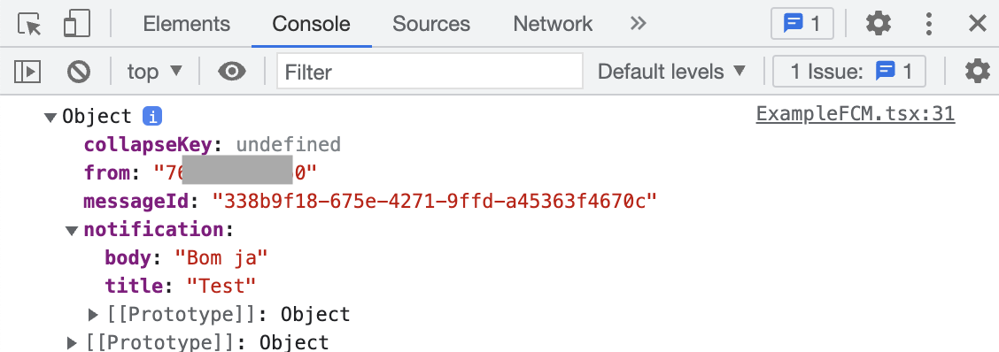
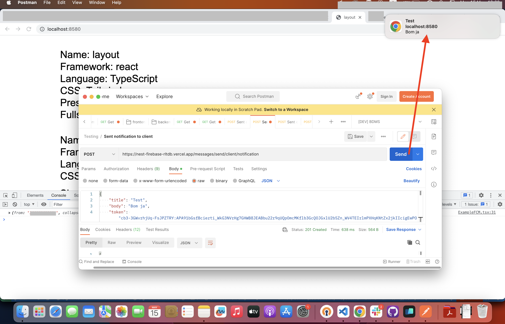

# **Firebase Cloud Message on Web**



## **Notification**

Firebase provides 2-ways to notice web browser's client :

- Pub/Sub specific topic name via `Cloud Messaging API (Legacy)`.
- Sending message to specific browser client via client's token.

### **Pub/Sub specific topic**

This method allows client side subscribe specific topic from server side via `Cloud Messaging API (Legacy)`. The API is disabled by default, you need to enable it first.



`Cloud Messaging API (Legacy)` of Google Cloud APIs allow you to unlimited subscriber but ***limit your topic to 3,000 topics per application*** (for more detail, please refer to **Reference** to topic).

### **Sending message via client's token**

This method requires current client's token. Client side received the current token everytime when we call `getToken`. The token is temporary token, it will be generated everytime when user open browser(or our web application) if you set it into HOC.



Web application need send the token to server side to identify current client *(by mapping client ID & token in somewhere, ex. Redis, ... etc.)*.

In server side, microservice will sending message to client based on the token.

> **IMPORTANT**: In client side requires service worker file name  `firebase-messaging-sw.js`, it can handle notification message when user minimize browser or changed tab.

### **Example Initial/Config FCM**

> Ref. [Initial/Config FCM](../src/configs/firebase.ts).

Let's initial Firebase app :

```tsx
import { initializeApp, FirebaseOptions } from "firebase/app";

import { 
    getMessaging,
    getToken,
    deleteToken,
    onMessage,
} from "firebase/messaging";

const firebaseConfig: FirebaseOptions = {
  apiKey: process.env.REACT_APP_FIREBASE_API_KEY,
  authDomain: process.env.REACT_APP_FIREBASE_AUTH_DOMAIN,
  databaseURL: process.env.REACT_APP_FIREBASE_DATABASE_URL,
  projectId: process.env.REACT_APP_FIREBASE_PROJECT_ID,
  storageBucket: process.env.REACT_APP_FIREBASE_STORAGE_BUCKET,
  messagingSenderId: process.env.REACT_APP_FIREBASE_MSG_SENDER_ID,
  appId: process.env.REACT_APP_FIREBASE_APP_ID,
  measurementId: process.env.REACT_APP_FIREBASE_MEASUREMENT_ID,
};

// Initialize Firebase
const app = initializeApp(firebaseConfig);
```

Prepare cloud message :

```tsx
const messaging = getMessaging(app);

async function initFCM() {
    // 1. Get token from cloud message channel with specific Firebas's vapid key, it returns current token for this client (I called it client's token).

    // 2. Check token

        // 2.1. If client's token is valid, 
        
            // 2.1.a. In case we "Sending message via client's token":
            // We need to send the token to our server to record it to our side. It will be used to identify the client when sending notification.

            // 2.1.b. In case we "Pub/Sub specific topic":
            // We need to call Cloud Message API (Legacy) to subscribe it. The result will receive via `onMessage`.

        // 2.2. Otherwise show error
}

async function requestNotificationPermission() {
    // case a. User allowed/enabled Notification (granted)

        // a.1. Start using FCM by calling initFCM() to get token or subscribe specific topic.

    // case b. User disabled Notification (denied)

        // b.1. Ask them to allow it

            // b.1.1. allowed, calling initFCM()
            // b.1.2. not allowed, show warning

    // case c. Handle other negative cases
}
```

Prepare other support function :

* Let's start from sending token to our server side. I provide example function to allow application set `sending` flag to `true`/`false`.

  - isTokenSentToServer
  - setTokenSentToServer
  - sendTokenToServer

  ```tsx
  const isTokenSentToServer = () => {
      return window.localStorage.getItem('sentToServer') === '1';
  }
  
  const setTokenSentToServer = (sent: boolean) => {
      window.localStorage.setItem('sentToServer', sent ? '1' : '0');
  }
  
  const sendTokenToServer = async (currentToken: any) => {
      if (!isTokenSentToServer()) {
          console.log('Sending token to server...');
          setTokenSentToServer(true);
      } else {
          console.log('Token already sent to server so won\'t send it again ' +
              'unless it changes');
      }
  };
  ```

* Prepare subscriber :

   - Assume I would like to send message via topic name **TestFCM**.

    ```tsx
    const SUBSCRIBED_MSG_TOPIC = 'TestFCM';
    ```

   - subscribeToTopic

    ```tsx
    const subscribeToTopic = async (topic: string, token: string) => {
        // Subscribe to the topic, requires Cloud Messaging API (Legacy) enabled.
        // Ref. https://console.cloud.google.com/apis/library/googlecloudmessaging.googleapis.com?authuser=0&project=766275633550&hl=en
        const topicURL: string = `https://iid.googleapis.com/iid/v1/${token}/rel/topics/${topic}`;

        const headers = new Headers();
        headers.append('content-type', 'application/json');
        headers.append('Authorization', `key=${process.env.REACT_APP_FIREBASE_CM_API_LEGACY}`);

        const response = await fetch(topicURL, { method: 'POST', headers })
        .then((r) => ({ data: r, error: null }))
        .catch((e) => ({ data: null, error: e }))

        console.log('subscribeToTopic:', response)

        return response;
    }
    ```

* Prepare message listener :

    ```tsx
    const onMessageListener = () => new Promise((resolve) => {
        onMessage(messaging, (payload) => {
            resolve(payload);
        });
    });
    ```

Fulfill `initFCM` function :

```tsx
async function initFCM() {
    const token = await getToken(messaging, { vapidKey:process.env.FIREBASE_VAPID_KEY })
    .then((currentToken: any) => {


        // *************************************************
        // Please remove this line in production
        console.log('current token:', currentToken)
        // *************************************************


        return currentToken
        ? { data: currentToken, error: null }
        : { data: null, error: 'No registration token available. Request permission to generate one.' }
    }).catch((err: any) => ({ data: null, error: err }));

    if(token.data) {
        await sendTokenToServer(token.data);


        // *************************************************
        // Not need to use this statement if you don't want to subscribe any topics.
        await subscribeToTopic(SUBSCRIBED_MSG_TOPIC, token.data)
        // *************************************************


    } else {
        console.log(token.error)
    }
}
```

Setup `Notification` from native Web API :

```tsx
// Request notification permissions from the user
async function requestNotificationPermission() {
    if (!('Notification' in window)) {
        // Check if the browser supports notifications
        alert('This browser does not support desktop notification');
    } else if (Notification.permission === 'granted') {
        new Notification('Welcome');
        await initFCM();
    } else if (Notification.permission !== 'denied') {
        // We need to ask the user for permission
        Notification.requestPermission().then(async (permission) => {
            // If the user accepts, let's create a notification
            if (permission === 'granted') {
                await initFCM();
            } else {
                console.log('Unable to get permission to notify.');
            }
        });
    }
}
```

Export to use in other component :

```tsx
export {
    onMessageListener,
    requestNotificationPermission
}
```

### **Example Frontend**

```tsx
import { requestNotificationPermission, onMessageListener } from '../configs/firebase';
import React, { useEffect, useState } from 'react';

function ExampleFCM() {
  const [notification, setNotification] = useState({title: '', body: ''});

  onMessageListener().then(payload => {
    setNotification({title: payload?.notification?.title, body: payload?.notification?.body})
  }).catch(err => console.log('failed: ', err));

  useEffect(() => {
    requestNotificationPermission();
  }, []);

  useEffect(() => {
    new Notification(notification.title, {
      body: notification.body
    });
  }, [notification]);

  return (
    <div>
      
    </div>
  );
}

export default ExampleFCM;
```

Example received payload :



### **Example Backend**

In backend service, you need to use `firebase-admin` to send :

* Data
   - Based on `token`, it requires payload's schema : 
        ```ts
        interface { 
            token: string;
            data: { 
                [x: string]: string
            }
        }
        ```
   - Based on `topic`, it requires payload's schema : 
        ```ts
        interface { 
            topic: string;
            data: {
                [x: string]: string
            }
        }
        ```
* Notification
   - Based on `token`, it requires payload's schema : 

        ```ts
        interface {
            token: string;
            notification: {
                title: string;
                body: string;
            },
        }
        ```
   - Based on `topic`, it requires payload's schema : 

        ```ts
        interface {
            condition: string;
            notification: {
                title: string;
                body: string;
            },
        }
        ```

Before start, please prepare send message function :

```ts
import * as admin from 'firebase-admin';

@Injectable()
export class MessagesService {

    // ...

    async send(msg: Messaging) {
        try {
            const result = await admin.messaging().send(msg)
            .then((response) => ({ data: response, error: null }))
            .catch((error) => ({ data: null, error }));

            return result

        } catch (error) {
            return { data: null, error };
        }
    }
}
```

Example service :

```tsx
@Injectable()
export class MessagesService {
    
    // ...

    async sendData(msg: MessageDataDto) {
        return await this.send({
            token: msg.token,
            data: msg.data,
        })
    }

    async sendDataWithTopic(msg: MessageDataWithTopicDto) {
        return await this.send({
            topic: msg.topic,
            data: msg.data,
        })
    }

    async sendNotificationWithTopic(msgWithTopic: MessageContentWithTopicDto) {
        return await this.send({
            condition: `\'${msgWithTopic.topic}\' in topics`,
            notification: {
                title: msgWithTopic.title,
                body: msgWithTopic.body,
            },
        })
    }

    async sendNotification(msg: MessageContentDto) {
        return await this.send({
            token: msg.token,
            notification: {
                title: msg.title,
                body: msg.body,
            },
        })
    }
}
```

Example usage (based on above service) :



In case you don't know client but plan to share data via specific topic :

```sh
curl --location 'https://nest-firebase-rltdb.vercel.app/messages/send/topic/notification' \
--header 'x-api-key: tST7aid0.........................j4FKg=' \
--header 'Content-Type: application/json' \
--data '{
    "title": "Test",
    "body": "Bom ja",
    "topic": "TestFCM"
}'
```

In case you known the client by refer to their `token` :

```sh
curl --location 'https://nest-firebase-rltdb.vercel.app/messages/send/client/notification' \
--header 'x-api-key: tST7aid0.........................j4FKg=' \
--header 'Content-Type: application/json' \
--data '{
    "title": "Test",
    "body": "Bom ja",
    "token": "cb3-3GWvrhjUq-FsJPZTRY:APA91bGsfBciezti_WkG3NVrHg7GHWB8JEABbu22r9qUQpOmcMKflb3GcQOJGxlU2b5Zn_WV4TEIrlmPXHqKNtZx2jkIIcigEwPOeyWLG-fJjNNoOKiU63Z_8_kqEbHiV-3GrEkA-u2f"
}'
```

## **References**

- [About FCM messages & limitation](https://firebase.google.com/docs/cloud-messaging/concept-options)
